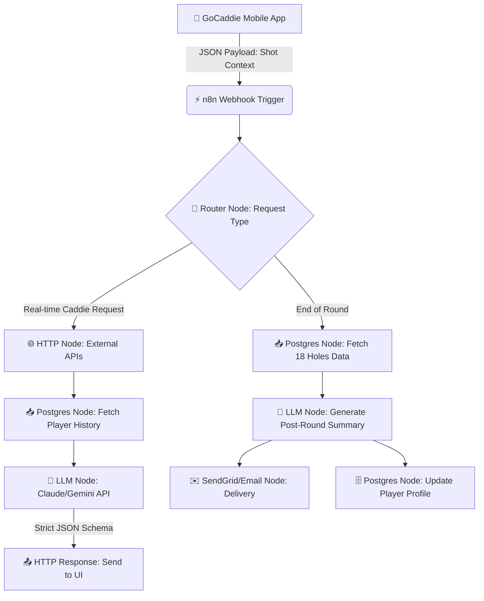

# GoCaddie AI - Backend Automation Architecture

This document outlines the n8n automation pipeline that powers the GoCaddie AI engine, ensuring low-latency responses, continuous player profiling, and seamless post-round analytics.

## ⚙️ Core Workflow Pipeline

## 🧩 Pipeline Components Explained

### 1. The Trigger (Webhook)
The pipeline begins when the mobile UI or web frontend sends a structured JSON payload containing the player's current context: `distance, lie, slope, wind_speed, handicap`.

### 2. Context Enrichment (Postgres + APIs)
Before any AI inference happens, the workflow enriches the prompt:
- **Weather API:** Validates the localized wind conditions.
- **PostgreSQL:** Pulls the player's historical shot dispersion (e.g., "Player misses left under pressure 60% of the time").

### 3. The LLM Engine
We use an LLM node configured with a strict system prompt (the Tour Caddie Persona) and enforce structured outputs. By injecting the enriched context, the AI doesn't guess—it calculates.

### 4. Continuous Learning (The Loop)
Every piece of advice given and every shot result recorded is piped back into the PostgreSQL database. This means the AI caddie gets progressively smarter and more tailored to the specific user over time.

---
> **Senior Engineer Insight:** By offloading this logic to an event-driven n8n workflow, we keep the Go backend incredibly lightweight. The core API only needs to route the request to the webhook, while the heavy lifting of API chaining and AI prompt assembly is visually managed and instantly scalable in n8n.
